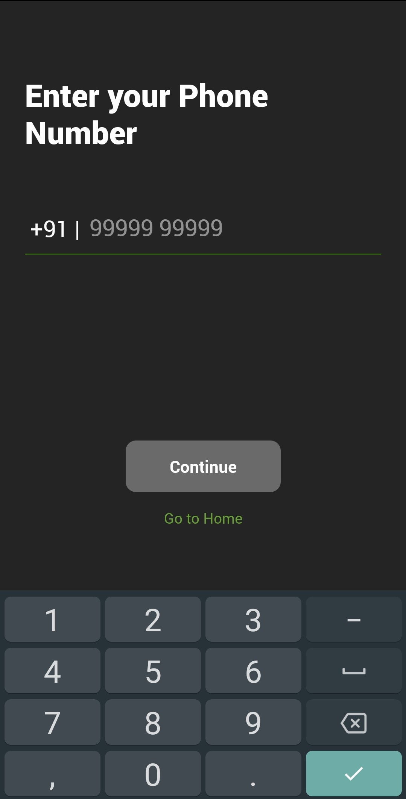
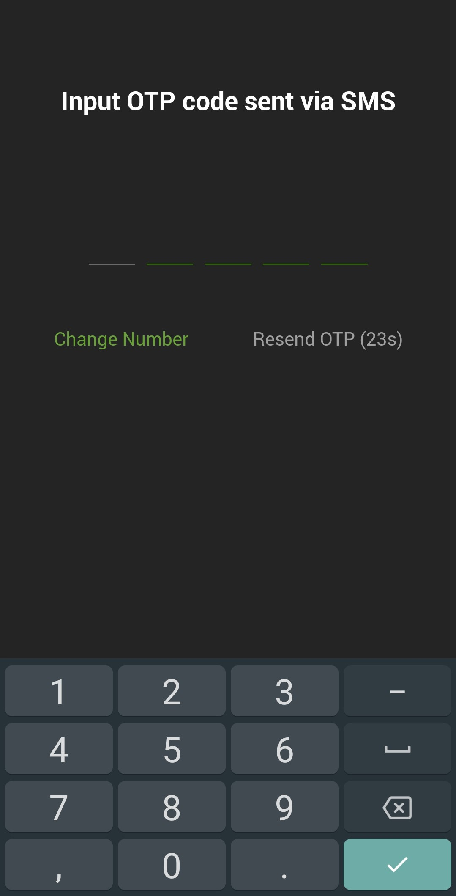
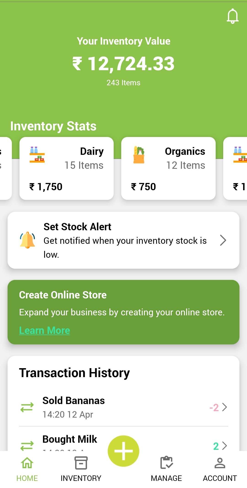
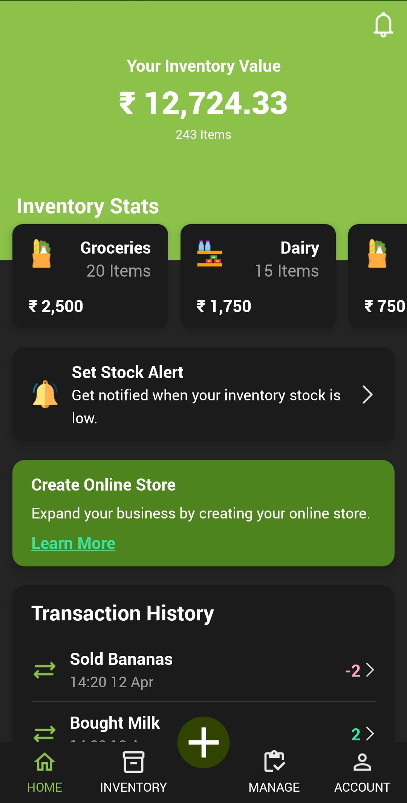
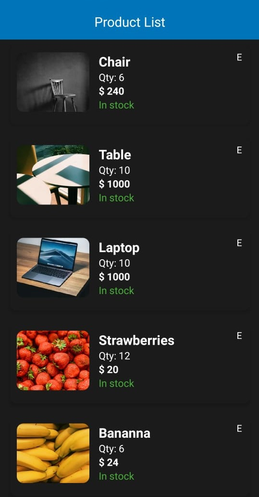

# Inventory App | React Native Client

  
   

  
   
  

## Requirements

    $ Android Emulator, or
    $ Android Phone

## Insatll Dependencies

    $ npm install

## Run android app

    $ npx react-native run-android